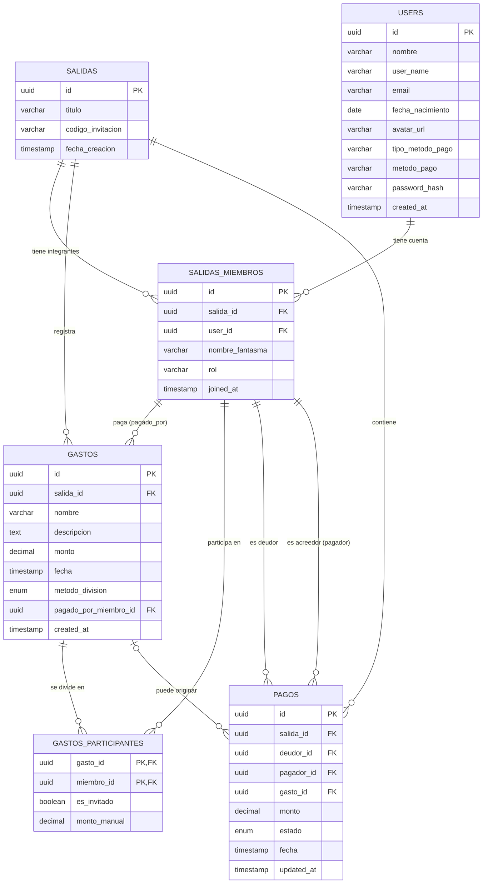

# Diagrama del Modelo de Base de Datos

A continuación tienes el diagrama Entidad-Relación (ER) que representa visualmente el modelo de base de datos para el backend de Crumbs. 

> [!TIP]
> Dado que Github Flavored Markdown soporta `mermaid`, el bloque superior se renderizará automáticamente como un diagrama visual en plataformas como GitHub, Notion o en visores de Markdown compatibles. También puedes copiar el bloque de código y pegarlo en [Mermaid Live Editor](https://mermaid.live/) para exportarlo como imagen PNG o SVG.
