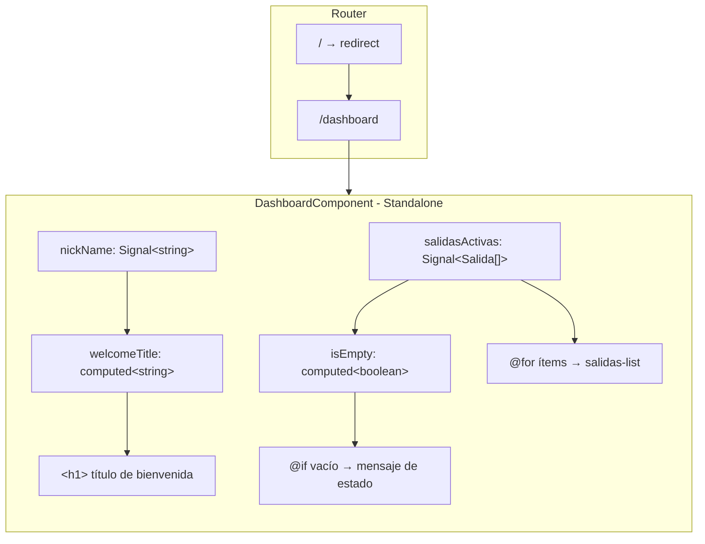
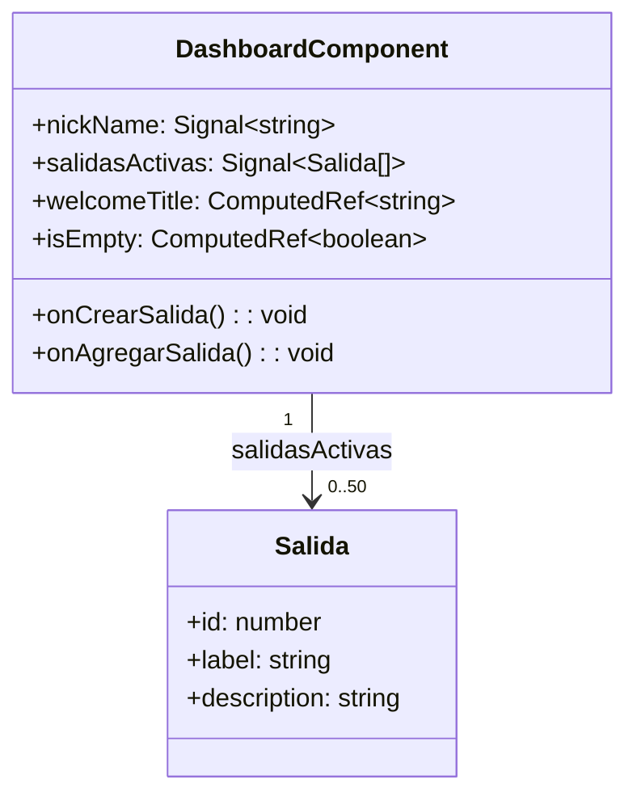

# Design Document — dashboard-view

## Overview

El módulo `dashboard-view` es la vista principal de la aplicación Crumbs. Actúa como punto de entrada del usuario autenticado: muestra un saludo personalizado, dos acciones rápidas para gestionar salidas y una lista de salidas activas. El componente no contiene ningún elemento de navegación global (Header, Navbar, Logo, botones de sesión); esa responsabilidad pertenece a la capa de la aplicación.

### Contexto tecnológico

| Capa | Tecnología |
|---|---|
| Framework | Angular 21, standalone components |
| Estado | Angular Signals (`signal`, `computed`) |
| UI | Angular Material 21 con tema M3 (color primario Magenta/Purple `#6750A4`) |
| Estilos | Tailwind CSS 4 (utilidades en template) + SCSS encapsulado (tokens y estados) |
| Build | Vite + Angular CLI |
| SSR | Angular SSR + Express 5 |
| Pruebas | Vitest 4 + jsdom |

---

## Architecture

El componente sigue una arquitectura de presentación pura: todo el estado es local y gestionado mediante Signals. No realiza peticiones HTTP ni accede a servicios externos en esta versión; las listas de salidas y el nickName se inicializan con datos en memoria.



**Flujo de datos:** unidireccional. Los Signals son la única fuente de verdad. Los `computed` derivan valores sin efectos secundarios. El template consume los Signals directamente mediante la sintaxis de llamada de función (`signal()`).

---

## Components and Interfaces

### DashboardComponent

**Selector:** `app-dashboard`  
**Archivo:** `src/app/features/dashboard/components/dashboard.component.ts`

#### Signals públicos (readonly)

| Signal | Tipo | Valor por defecto | Descripción |
|---|---|---|---|
| `nickName` | `Signal<string>` | `'Viajero'` | Alias del usuario, actualizable externamente vía `set()`. |
| `salidasActivas` | `Signal<Salida[]>` | Array con 3 salidas de ejemplo | Lista de salidas activas del usuario (máx. 50 ítems). |

#### Computed (readonly, sin efectos secundarios)

| Computed | Tipo | Fórmula |
|---|---|---|
| `welcomeTitle` | `computed<string>` | `` `¡Hola, ${nickName()}!` `` |
| `isEmpty` | `computed<boolean>` | `salidasActivas().length === 0` |

#### Métodos

| Método | Descripción |
|---|---|
| `onCrearSalida()` | Navega a la ruta de creación de salida (`/salidas/crear`). Actualmente registra en consola; pendiente de integración con `Router`. |
| `onAgregarSalida()` | Navega a la ruta de incorporación de salida (`/salidas/agregar`). Mismo estado de implementación. |

#### Imports del módulo (Angular Material)

- `MatButtonModule` — directiva `mat-flat-button`
- `MatCardModule` — contenedor card (semántico)
- `MatListModule` — soporte de lista semántica
- `MatRippleModule` — efecto ripple en ítems de lista

### Interfaz de dominio: Salida

```typescript
export interface Salida {
  id: number;
  label: string;        // máx. 60 caracteres; se trunca con CSS si supera el límite
  description: string;  // máx. 120 caracteres; se trunca con CSS si supera el límite
}
```

---

## Data Models

### Estado interno



### Restricciones de datos

- `nickName` acepta cualquier `string`, incluida la cadena vacía. El `computed` `welcomeTitle` siempre producirá `¡Hola, [valor]!` sin lanzar errores.
- `salidasActivas` tiene una capacidad máxima de 50 ítems documentada. La aplicación es responsable de aplicar esta restricción antes de llamar a `set()`.
- Los campos `label` y `description` no se truncan en el modelo; el truncado visual se aplica exclusivamente mediante CSS (`text-overflow: ellipsis; overflow: hidden; white-space: nowrap`).

### Layout del template

```
<section.dashboard-view>
  <h1.welcome-title>                  ← welcomeTitle()
  <div.grid>                          ← Tailwind: grid-cols-1 md:grid-cols-2 gap-6 mt-6
    <div.actions-column>              ← role="group"
      <button[mat-flat-button]>       ← "Crear Salida" → onCrearSalida()
      <button[mat-flat-button]>       ← "Agregar Salida" → onAgregarSalida()
    <div.salidas-card>                ← role="region"
      <h2>                            ← "Mis Salidas Activas"
      @if isEmpty() → <p role="status">   ← empty state
      @else → <ul.salidas-list>
               @for salida → <li[matRipple]>
                               <span.label>
                               <span.description>
```

---

## Correctness Properties

*A property is a characteristic or behavior that should hold true across all valid executions of a system — essentially, a formal statement about what the system should do. Properties serve as the bridge between human-readable specifications and machine-verifiable correctness guarantees.*

---

### Property 1: welcomeTitle es una función pura del nickName

*Para cualquier* string `name`, si `nickName` Signal tiene el valor `name`, entonces `welcomeTitle()` debe ser igual a `` `¡Hola, ${name}!` ``.

**Validates: Requirements 1.1, 1.3, 1.4**

---

### Property 2: Cada ítem renderizado expone label y description

*Para cualquier* array no vacío de `Salida`, cada elemento renderizado en la lista debe contener tanto el texto del `label` como el texto de la `description` del ítem correspondiente.

**Validates: Requirements 4.2**

---

### Property 3: Solo el primer ítem recibe el estado activo

*Para cualquier* array no vacío de `Salida`, exactamente el primer elemento renderizado debe tener la clase `salidas-list__item--active` y ningún otro elemento de la lista debe tenerla.

**Validates: Requirements 4.4, 4.5**

---

### Property 4: Todos los elementos interactivos tienen aria-label no vacío

*Para cualquier* estado del componente (lista vacía o no vacía), todos los botones y elementos interactivos del DOM deben tener un atributo `aria-label` o `role` con valor no vacío.

**Validates: Requirements 5.7**

---

## Error Handling

### Navegación fallida

Los métodos `onCrearSalida()` y `onAgregarSalida()` invocarán `Router.navigate()` cuando se integre el router. Si la navegación falla (ruta no configurada, guard rechazando), el error se capturará dentro del método y se registrará en consola sin propagar la excepción. Esto garantiza que la interfaz no quede bloqueada (Requirement 3.7).

```typescript
async onCrearSalida(): Promise<void> {
  try {
    await this.router.navigate(['/salidas/crear']);
  } catch (err) {
    console.error('[DashboardComponent] navegación fallida:', err);
  }
}
```

### SSR — acceso a APIs del navegador

El componente en su estado actual no accede a `document`, `window` ni `localStorage`. Si en el futuro se añaden accesos a estas APIs, se deben envolver con `isPlatformBrowser(this.platformId)` o diferir su ejecución con `afterNextRender()` (Angular 17+). Esto satisface el Requirement 5.6.

### Signal con cadena vacía

`welcomeTitle` usa interpolación de template literal; nunca lanza excepciones independientemente del valor de `nickName`. El caso `nickName = ''` produce `'¡Hola, !'`, que es el comportamiento especificado en Requirement 1.4.

### Lista de salidas vacía

El template usa `@if (isEmpty())` para cambiar entre la vista de lista y el mensaje de estado vacío. El elemento de estado vacío tiene `role="status"` para lectores de pantalla (Requirement 5.8).

---

## Testing Strategy

### Herramientas

- **Test runner:** Vitest 4 (`vitest --run` para ejecución única)
- **DOM simulation:** jsdom (ya incluido como devDependency)
- **Property-based testing:** [fast-check](https://github.com/dubzzz/fast-check) — librería de PBT para TypeScript/JavaScript, madura y bien mantenida
- **Componentes Angular:** `@angular/core/testing` con `TestBed`

### Estrategia dual

Las pruebas se dividen en dos categorías complementarias:

**Pruebas de ejemplo (unit tests):** verifican comportamientos concretos y condiciones de borde.

**Pruebas de propiedades (property-based tests):** verifican invariantes universales sobre rangos amplios de entradas generadas. Cada propiedad se ejecuta con mínimo **100 iteraciones**.

### Pruebas de ejemplo

| Criterio | Descripción |
|---|---|
| Req 1.2 | `nickName` es un Signal con valor por defecto `''` (o el valor inicial configurado). |
| Req 2.1–2.3 | El contenedor grid tiene las clases `grid-cols-1 md:grid-cols-2 gap-6`. |
| Req 3.1 | Exactamente dos botones con etiquetas `"Crear Salida"` y `"Agregar Salida"`. |
| Req 3.2 | Los botones tienen el atributo `mat-flat-button`. |
| Req 3.5–3.6 | Click en cada botón llama al método correspondiente (mock del router). |
| Req 4.1 | El card de salidas tiene `<h2>Mis Salidas Activas</h2>`. |
| Req 4.6 / 5.8 | Con lista vacía: aparece el mensaje de estado con `role="status"`. |
| Req 5.1 | El componente declara `standalone: true` en los metadatos. |
| Req 5.5 | El template no contiene `<header>`, `<nav>`, ni botones de sesión. |
| Req 5.6 | No se producen errores al inicializar el componente sin `window`/`document`. |

### Pruebas de propiedades (fast-check)

Cada test de propiedad debe incluir el siguiente comentario de etiqueta:

**Formato de etiqueta:** `// Feature: dashboard-view, Property {N}: {texto de la propiedad}`

#### Property 1: welcomeTitle es una función pura del nickName

```typescript
// Feature: dashboard-view, Property 1: welcomeTitle es una función pura del nickName
fc.assert(
  fc.property(fc.string(), (name) => {
    component.nickName.set(name);
    expect(component.welcomeTitle()).toBe(`¡Hola, ${name}!`);
  }),
  { numRuns: 100 }
);
```

#### Property 2: Cada ítem renderizado expone label y description

```typescript
// Feature: dashboard-view, Property 2: Cada ítem renderizado expone label y description
fc.assert(
  fc.property(
    fc.array(
      fc.record({
        id: fc.integer({ min: 1 }),
        label: fc.string({ maxLength: 60 }),
        description: fc.string({ maxLength: 120 }),
      }),
      { minLength: 1, maxLength: 50 }
    ),
    (salidas) => {
      component.salidasActivas.set(salidas);
      fixture.detectChanges();
      const items = fixture.nativeElement.querySelectorAll('.salidas-list__item');
      expect(items.length).toBe(salidas.length);
      salidas.forEach((salida, i) => {
        expect(items[i].querySelector('.salidas-list__label').textContent).toContain(salida.label);
        expect(items[i].querySelector('.salidas-list__description').textContent).toContain(salida.description);
      });
    }
  ),
  { numRuns: 100 }
);
```

#### Property 3: Solo el primer ítem recibe el estado activo

```typescript
// Feature: dashboard-view, Property 3: Solo el primer ítem recibe el estado activo
fc.assert(
  fc.property(
    fc.array(
      fc.record({
        id: fc.integer({ min: 1 }),
        label: fc.string({ maxLength: 60 }),
        description: fc.string({ maxLength: 120 }),
      }),
      { minLength: 1, maxLength: 50 }
    ),
    (salidas) => {
      component.salidasActivas.set(salidas);
      fixture.detectChanges();
      const items = fixture.nativeElement.querySelectorAll('.salidas-list__item');
      expect(items[0].classList.contains('salidas-list__item--active')).toBe(true);
      for (let i = 1; i < items.length; i++) {
        expect(items[i].classList.contains('salidas-list__item--active')).toBe(false);
      }
    }
  ),
  { numRuns: 100 }
);
```

#### Property 4: Todos los elementos interactivos tienen aria-label no vacío

```typescript
// Feature: dashboard-view, Property 4: Todos los elementos interactivos tienen aria-label no vacío
fc.assert(
  fc.property(
    fc.array(
      fc.record({
        id: fc.integer({ min: 1 }),
        label: fc.string({ maxLength: 60 }),
        description: fc.string({ maxLength: 120 }),
      }),
      { maxLength: 50 }
    ),
    (salidas) => {
      component.salidasActivas.set(salidas);
      fixture.detectChanges();
      const buttons = fixture.nativeElement.querySelectorAll('button');
      buttons.forEach((btn: Element) => {
        const label = btn.getAttribute('aria-label') ?? btn.textContent?.trim() ?? '';
        expect(label.length).toBeGreaterThan(0);
      });
    }
  ),
  { numRuns: 100 }
);
```

### Cobertura de condiciones de borde

Las siguientes condiciones de borde son cubiertas implícitamente por los generadores de fast-check, por lo que no requieren tests separados:

- `nickName = ''` → cubierto por Property 1 (fc.string() genera cadena vacía)
- Lista con un solo ítem → cubierto por Property 3 (minLength: 1)
- Lista con 50 ítems → cubierto por Properties 2 y 3 (maxLength: 50)
- Error de navegación (Req 3.7) → prueba de ejemplo con mock de Router que rechaza la promesa
