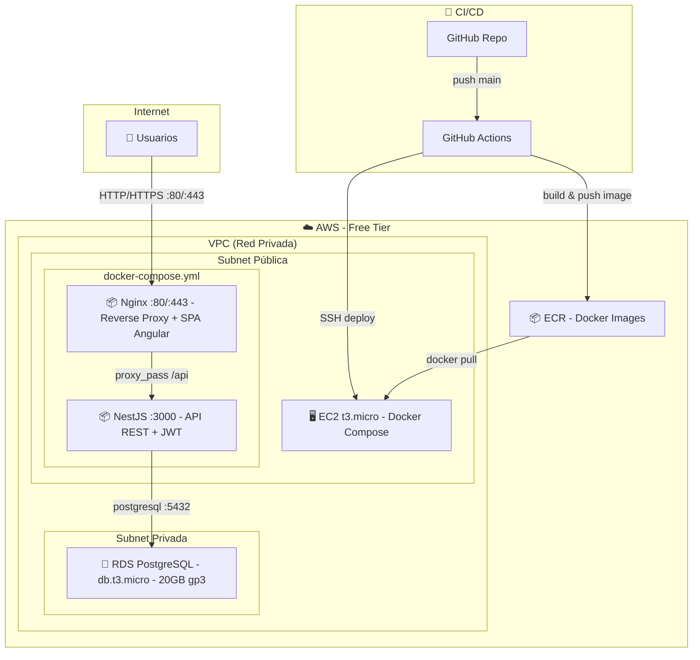
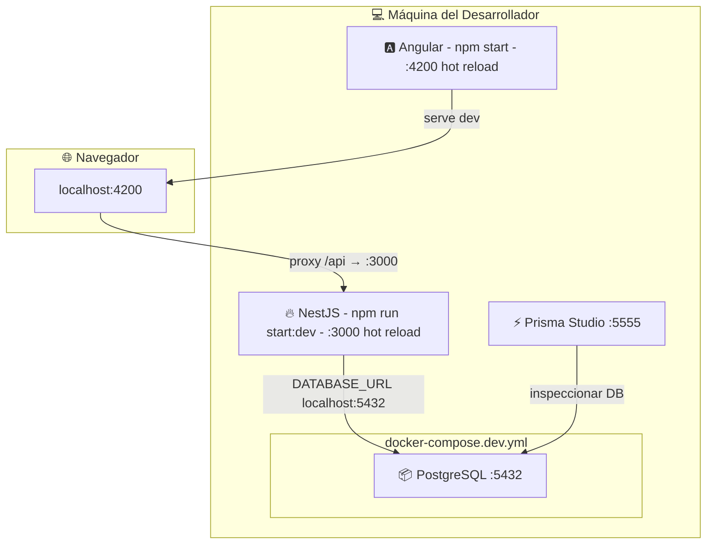
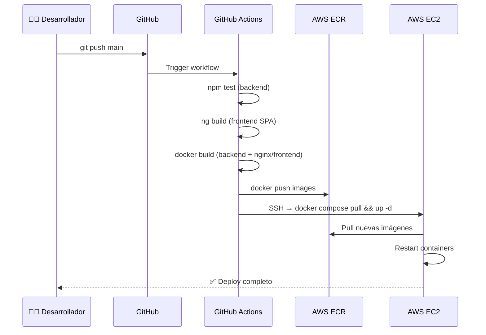

# Arquitectura Crumbs — Diagramas

## Diagrama 1: Arquitectura AWS (Producción)

---

## Diagrama 2: Arquitectura Local (Desarrollo)

---

## Diagrama 3: Flujo de Deploy (CI/CD)

---

## Diagrama 4: Visión General (Local + Producción)

```mermaid
graph LR
    subgraph DEV["🏠 DESARROLLO LOCAL"]
        FE_DEV["Angular :4200"]
        BE_DEV["NestJS :3000"]
        DB_DEV["PostgreSQL :5432 Docker"]

        FE_DEV -->|"/api proxy"| BE_DEV
        BE_DEV --> DB_DEV
    end

    subgraph PROD["☁️ AWS PRODUCCIÓN"]
        subgraph EC2_BOX["EC2 t3.micro"]
            NGX["Nginx :80"]
            BE_PROD["NestJS :3000"]
        end
        RDS_PROD["RDS PostgreSQL :5432"]

        NGX -->|"/api"| BE_PROD
        BE_PROD --> RDS_PROD
    end

    subgraph USERS["🌍 USUARIOS"]
        BROWSER["Navegador"]
    end

    BROWSER -->|"HTTPS"| NGX
```

---

## Resumen de costos (3 semanas)

| Servicio | Free Tier | Costo |
|----------|-----------|-------|
| EC2 t3.micro | 750 h/mes gratis | $0 |
| RDS db.t3.micro | 750 h/mes + 20GB | $0 |
| ECR | 500MB gratis | $0 |
| Data Transfer | 100GB/mes gratis | $0 |
| **Total** | | **$0** |
